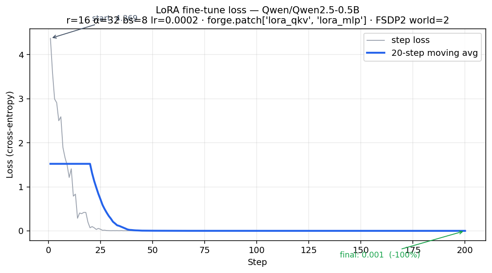
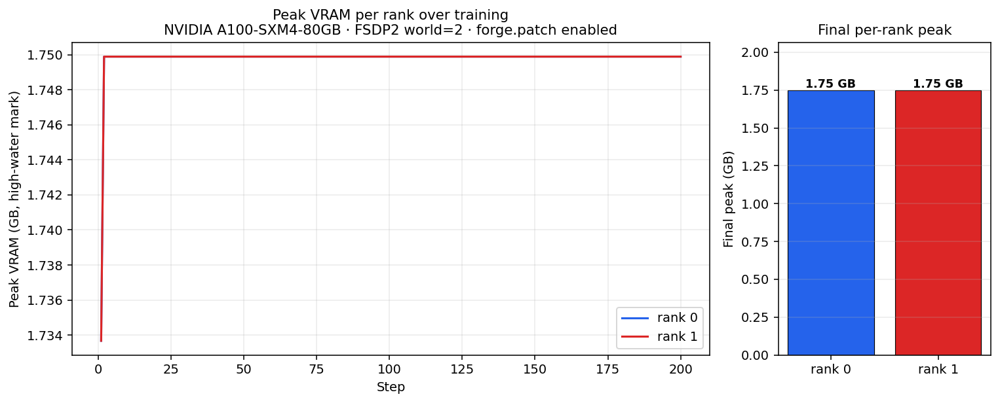
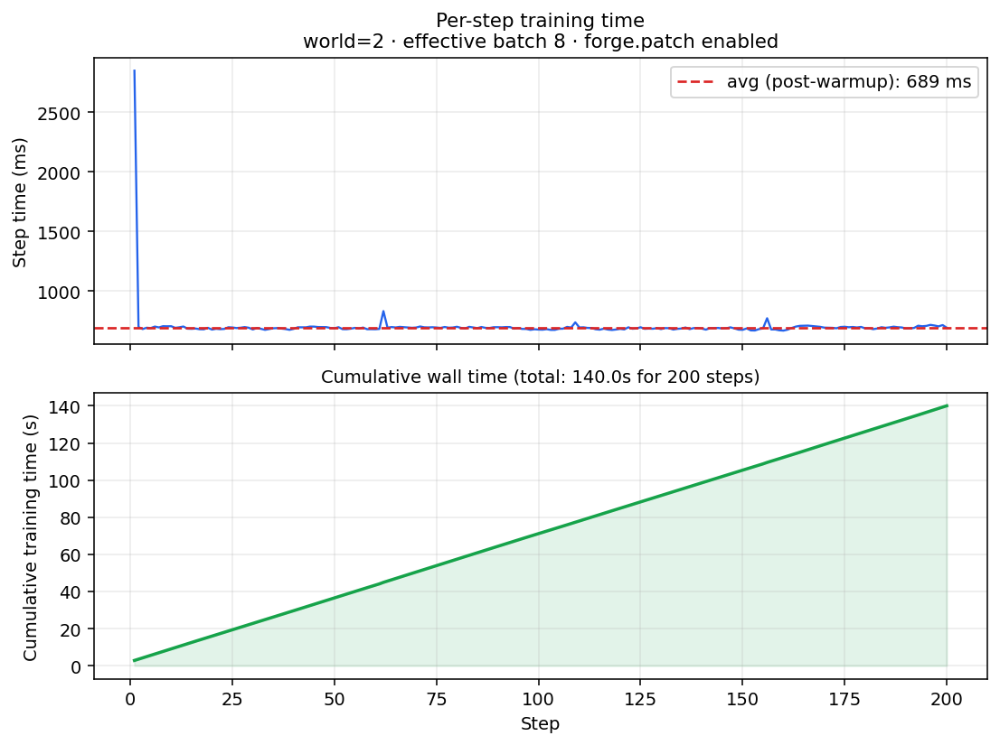

# Forge LoRA fine-tune — artifacts

**Model:** `Qwen/Qwen2.5-0.5B`
**Setup:** FSDP2 world=2 · NVIDIA A100-SXM4-80GB · torch 2.7.0
**Kernels patched by `forge.patch`:** `['lora_qkv', 'lora_mlp']` → counts `{'lora_qkv': 24, 'lora_mlp': 24}`
**LoRA:** r=16, α=32, targets q/k/v/gate/up/down
**Training:** 200 steps, lr=0.0002, effective batch 8 (= 2 × 4 micro-batches), max_seq=512

## Numbers

| Metric | Value |
|---|---|
| First-step loss | 4.3686 |
| Final-step loss | 0.0005 |
| Minimum loss | 0.0004 |
| Loss reduction | 100.0% |
| Final peak VRAM per rank | 1.75 GB, 1.75 GB |

## Charts

| | |
|---|---|
|  |  |
|  | (one-pager: `summary.png`) |

See `summary.png` for a single-figure dashboard combining all of the above.
See `inference_samples.md` for held-out generations before vs after fine-tune.
